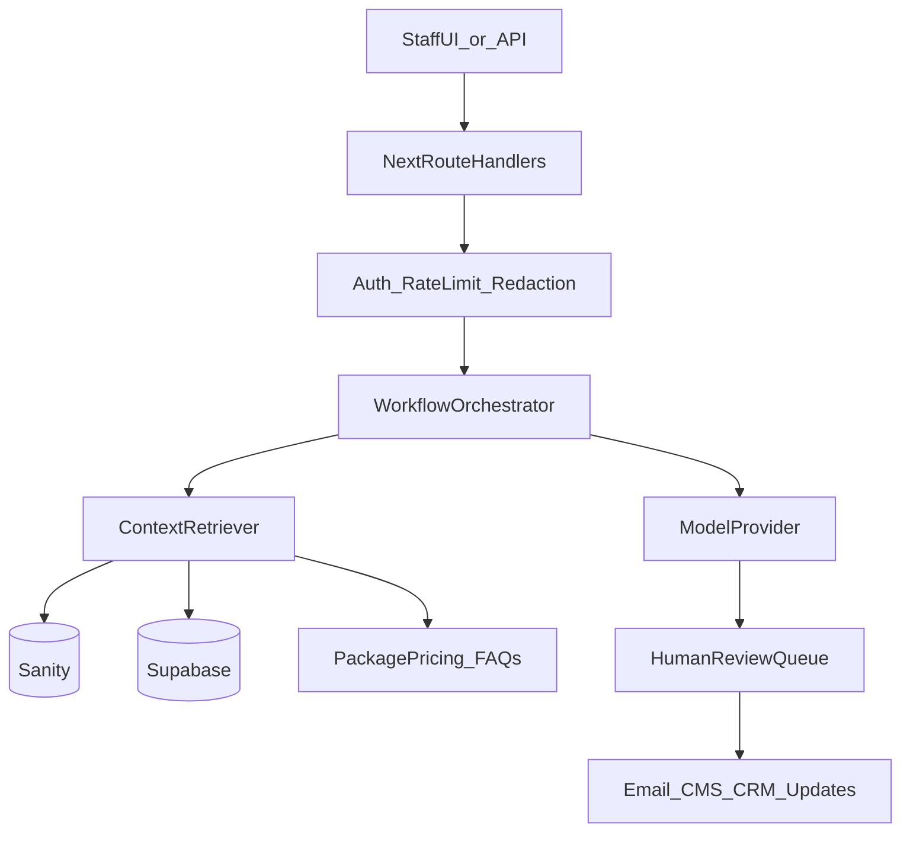

# AI Roadmap

**Status:** Architecture only — internal tools first, human-in-the-loop always  
**Constraint:** No client-facing autonomous AI in v1

---

## 1. Purpose

Use AI to accelerate studio operations:

- Quote generator
- Lead qualification
- Customer support drafts
- Content assistant (blog/resources)
- Proposal assistant
- Workflow automation

Goal: faster delivery and higher close rates — not a public chatbot that invents pricing.

---

## 2. Principles

1. **Internal before external** — staff tools land first.
2. **Human approval** for anything a client sees.
3. **Grounding** — prompts include package prices, FAQs, and project facts from DB/CMS.
4. **Auditability** — store prompts/outputs for sensitive flows (quotes/proposals).
5. **Cost control** — small models for triage; larger models for long-form drafts.

---

## 3. Target architecture

### Components

| Component | Recommendation |
|-----------|----------------|
| Gateway | Next.js `app/api/ai/*` (admin-only) |
| Queue (later) | Supabase jobs / Inngest / BullMQ when volume grows |
| Models | Start with one provider (OpenAI or Anthropic) behind an interface |
| Storage | `ai_runs` table: input refs, output, model, reviewer, status |
| Retrieval | Structured context first; vector search later if needed |

---

## 4. Feature roadmap

### Phase A — Lead qualification (internal)
- Input: contact/quote form payload
- Output: score + suggested package + missing questions
- Action: admin sees card in a simple `/admin` or Notion/email digest

### Phase B — Quote draft assistant
- Input: service interest, notes, budget band
- Output: draft quote email using fixed price table from `lib/content/services.ts` / CMS
- Guardrails: never invent discounts; flag Enterprise/Custom as “quotation required”

### Phase C — Proposal assistant
- Input: discovery notes
- Output: Markdown proposal sections (scope, timeline, investment, assumptions)
- Human edits in Studio docs or Google Docs before send

### Phase D — Content assistant
- Input: topic + outline
- Output: blog/resource draft → Sanity as **draft** (never auto-publish)

### Phase E — Support draft replies
- Input: client message (portal or email)
- Output: suggested reply with links to portal project/invoice
- Agent must cite project facts; escalate if uncertain

### Phase F — Workflow automation
- Triggers: new booking, waitlist join, invoice overdue
- Actions: summarise, tag, create checklist tasks for staff
- Still no autonomous client emails without approval rules

---

## 5. Safety & compliance

- System prompts: “You are an internal assistant for Nuriya Studio. Do not fabricate client results or prices.”
- PII: minimise logs; redact phone/email in model logs where possible.
- POPIA-minded retention: define retention on `ai_runs`.
- No training on client private assets without explicit agreement.

---

## 6. Integration with current stack

| Current | AI use |
|---------|--------|
| `/api/contact`, `/api/quote`, `/api/book` | Post-process qualification jobs |
| Sanity | Draft content writes; published content as grounding |
| Supabase | Store runs, portal context later |
| Resend | Send only after human approve (or strict templates) |
| Service/pricing libs | Canonical commercial grounding |

---

## 7. Suggested `/admin/ai` surface (future)

- Queue of drafts awaiting review
- One-click approve → send email / save Sanity draft
- Reject + feedback loop

Keep admin under auth; never ship under public marketing nav.

---

## 8. Non-goals

- Fully autonomous sales agent on WhatsApp
- Public site chatbot that books and prices without staff
- Replacing discovery calls

---

## 9. Success metrics

- Time-to-first-quote draft
- % quotes edited vs discarded
- Support first-response time
- Content draft throughput (without quality drop)

---

*Build only after Phase A business case is clear and portal/auth foundations exist where needed.*
