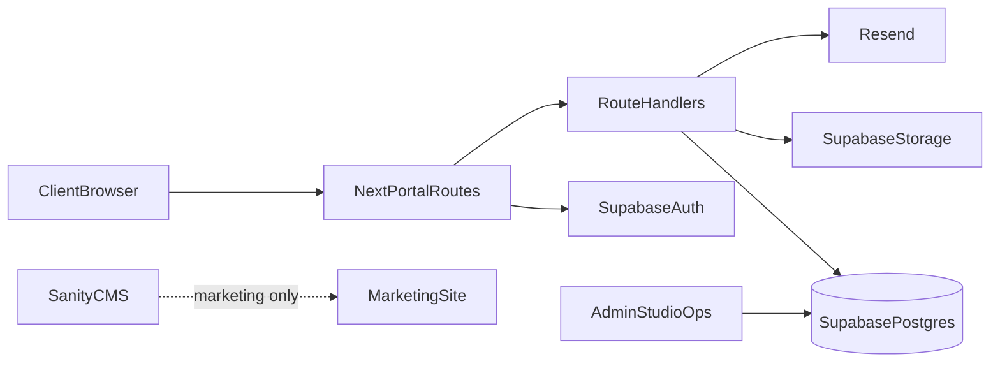

# Client Portal Architecture

**Status:** Architecture only — do not build until commercial site is converting  
**Intended route group:** `app/(portal)`  
**Shared with:** existing design system (`components/ui`), Supabase auth/data, Resend notifications

---

## 1. Purpose

Give clients a single place to:

- Track active projects
- View invoices and payment status
- Approve milestones / deliverables
- Submit revision requests
- Download assets
- Message support

This reduces WhatsApp/email chaos and supports Growth/Business retainers.

---

## 2. Principles

1. **Reuse the marketing design system** — no second visual language.
2. **Supabase as system of record** for portal data (projects, files metadata, messages, invoices).
3. **Auth-first** — nothing in `/portal` is public.
4. **Human workflows over automation** — approvals and messages stay explicit.
5. **Ship vertical slices** — Projects + Messages before Invoices/Payments.

---

## 3. High-level architecture



- Marketing site + Sanity remain separate from portal data.
- Portal uses Supabase Auth (email magic link or password) with roles `client` and `admin`.
- Optional later: Auth.js/Clerk if multi-provider SSO is required; default recommendation is **Supabase Auth** to stay aligned with booking/waitlist.

---

## 4. Route structure (proposed)

```
app/(portal)/
  layout.tsx                 # auth gate, portal nav, no marketing chrome
  page.tsx                   # dashboard
  projects/page.tsx
  projects/[id]/page.tsx
  invoices/page.tsx
  invoices/[id]/page.tsx
  approvals/page.tsx
  assets/page.tsx
  messages/page.tsx
  settings/page.tsx
app/api/portal/...           # mutation endpoints with RLS-aware service patterns
```

`robots.ts` already disallows `/api/`; add `/portal` disallow or `noindex` on portal layout.

---

## 5. Data model (Supabase)

### Core tables

| Table | Purpose |
|-------|---------|
| `profiles` | `id` (auth.users), role (`client`/`admin`), name, company |
| `clients` | Company record, billing email |
| `client_members` | profile ↔ client membership |
| `projects` | title, status, client_id, dates, summary |
| `project_milestones` | name, status, due_at, approval_required |
| `approvals` | milestone/deliverable, status, decided_by, notes |
| `revisions` | request text, status, project_id, created_by |
| `assets` | storage path, label, project_id, visibility |
| `invoices` | number, amount, currency, status, due_at, pdf_path |
| `threads` / `messages` | support/project messaging |
| `audit_log` | sensitive actions |

### RLS sketch

- Clients: `select/insert` only rows for their `client_id`.
- Admins: full access via role claim or `profiles.role = 'admin'`.
- Storage buckets: `client-assets` with path prefix `client_id/project_id/...`.

---

## 6. Modules & MVP slices

### Slice A — Foundation
Auth, profiles, portal shell, empty dashboard.

### Slice B — Projects
List/detail, status timeline, milestone list (read-only for clients).

### Slice C — Approvals & revisions
Approve/reject milestone; submit revision requests; email notify admin.

### Slice D — Assets
Upload (admin), download (client), signed URLs.

### Slice E — Invoices
List/detail, PDF download; payment links later (PayFast/Stripe).

### Slice F — Messaging
Project-scoped threads; email digests via Resend.

---

## 7. UX rules

- Portal first viewport: project status + next action (approve / pay / reply) — not a marketing dashboard collage.
- Same tokens/typography as marketing site; denser spacing allowed.
- Mobile-first: clients will approve from phones.
- No fake metrics; empty states must instruct the next step.

---

## 8. Security

- Enforce RLS; never trust client-supplied `client_id`.
- Signed URLs for assets (short TTL).
- Rate-limit message/revision endpoints.
- Admin impersonation (if added) must be audited.
- Separate `SUPABASE_SERVICE_ROLE_KEY` usage to server-only routes.

---

## 9. Integration points with current site

| Existing | Portal use |
|----------|------------|
| Supabase | Auth + portal DB (extend beyond bookings/waitlist) |
| Resend | Approval/invoice/message notifications |
| Design system | Shared buttons, forms, layout primitives |
| `/book` + CRM later | Project creation from won deals (manual first) |

---

## 10. Non-goals (v1)

- Full accounting suite
- Real-time multiplayer editing
- Client-facing AI auto-approvals
- Public project pages

---

## 11. Suggested build order after launch

1. Auth + Projects read-only  
2. Approvals + Revisions  
3. Assets  
4. Invoices  
5. Messaging  
6. Payment links  

---

*Document owner: Nuriya Studio engineering. Update when Slice A starts.*
