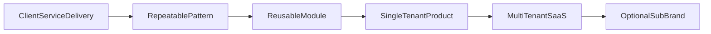

# SaaS Roadmap

**Status:** Product strategy + site architecture alignment  
**Business model:** Client websites → cash flow; software products → recurring revenue

---

## 1. Vision

Nuriya Studio becomes a software company that:

1. Delivers high-trust services (websites, booking, custom software)
2. Productises repeated delivery patterns into SaaS
3. Owns multiple platforms over time (Transport, Booking, Invoice, AI Automation, etc.)
4. Keeps sibling brands (Athariq, Little Light) secondary to the software company

---

## 2. Product portfolio (site-ready today)

| Product slug | Domain | Near-term offer | SaaS end-state |
|--------------|--------|-----------------|----------------|
| `transport-management` | Transport / tours | Custom software + waitlist | Multi-tenant ops platform |
| `fleet-management` | Fleets | Custom modules | Fleet SaaS add-on or standalone |
| `booking-platform` | Appointments / tours | Service package → product | Hosted booking product |
| `invoice-platform` | SMEs | Custom billing tools | Invoicing SaaS |
| `ai-automation-suite` | Internal ops | Retainer automation | Packaged AI workflows |
| `productivity-apps` | Teams | Small tools | App suite / upsell |

Marketing routes already exist under `/products/[slug]` with waitlists.

---

## 3. Productisation path

### Rules for promoting a service to SaaS

1. Delivered **3+ times** with >60% shared scope  
2. Clear buyer and willingness to pay monthly  
3. Support burden understood  
4. Data model stable enough for multi-tenant RLS  
5. Waitlist demand or outbound interest validated  

---

## 4. Technical platform (shared)

Build products on the same core already chosen for the studio site:

| Layer | Choice |
|-------|--------|
| App | Next.js App Router |
| DB/Auth | Supabase (Postgres + Auth + Storage + RLS) |
| Billing | Start PayFast/Stripe later per market |
| Email | Resend |
| CMS/Marketing | Sanity (this site) |
| Hosting | Railway (or split product apps later) |

### Multi-tenant defaults

- `tenants` table + `tenant_id` on all business rows  
- RLS by tenant membership  
- Separate custom domains optional at growth stage  
- Feature flags per tenant plan  

---

## 5. 12-month sequencing (product)

| Window | Focus |
|--------|-------|
| Months 1–2 | Launch studio site; gather waitlists; deliver services |
| Months 3–4 | Productise **Booking** from repeated client builds |
| Months 5–6 | Client portal MVP (feeds retention + product insights) |
| Months 7–8 | Transport/Fleet discovery with 1–2 design partners |
| Months 9–10 | Booking Platform beta (multi-tenant) |
| Months 11–12 | Invoice or AI Automation beta based on demand data |

Adjust ruthlessly based on waitlist + sales calls — do not build all six products in parallel.

---

## 6. Brand architecture

| Brand | Role | Site treatment |
|-------|------|----------------|
| **Nuriya Studio** | Parent software company | Primary site (this repo) |
| **Athariq** | Games | `/brands` + external URL |
| **Little Light** | Education | `/brands` + external URL |
| Future product names | May stay under Nuriya or sub-brand | `/products/[slug]` until spin-out |

Do not let sibling brands outrank the software CTA in primary navigation.

---

## 7. Monetisation

### Services (now)
- One-time packages (R2,499 → Enterprise)
- Monthly care plans (R299 / R699 / R1,299)

### Products (next)
- Waitlist → design partner pricing → standard SaaS tiers  
- Services remain the acquisition and implementation channel (“concierge onboarding”)

### Avoid
- Discounting SaaS to win one-off website deals without retention logic

---

## 8. Metrics that matter

- Service close rate and average deal size  
- Waitlist → conversation rate per product  
- % of projects that reuse shared modules  
- MRR from products vs services  
- Support tickets per tenant  

---

## 9. Relationship to this codebase

This repository is the **company marketing + CMS + lead capture** system.

Recommended future split:

1. Keep `Nuriya-Studio` as brand/marketing  
2. Create `nuriya-booking` / `nuriya-transport` apps when a product hits beta  
3. Share a private UI package or design tokens when duplication hurts  

Until then, `/products` waitlists and custom software delivery are enough.

---

## 10. Non-goals for the next two quarters

- Building all product UIs inside the marketing repo  
- Launching paid SaaS without design partners  
- Complex microservices  

---

*Revisit quarterly with sales and delivery data.*
